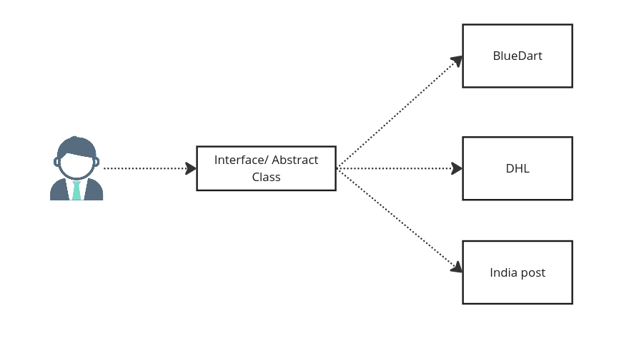

### What is Service Provider Interface

SPI stands for Service Provider Interface, which is a mechanism in Java that allows for the implementation of services to be provided by third-party providers. It is a way to decouple the implementation of a service from the code that uses the service.

### Here's how SPI works:

- **Service Interface**: A service is defined as an **interface** or an **abstract** class in Java. This service interface defines the contract for the service implementation.

- **Service Implementation**: Third-party providers (e.g., libraries, frameworks, or other modules) can *provide concrete implementations of the service interface.*

- **Service Configuration File**: Each service implementation is listed in a configuration file named `META-INF/services/<service-interface-name>`. This file contains the fully qualified class names of the service implementations, one per line.

- **Service Discovery and Loading**: The core framework or application uses the `java.util.ServiceLoader` class to discover and load the available service implementations listed in the configuration file(s).

- **Service Usage**: The core framework or application can then use the loaded service implementations as needed, without being tightly coupled to any specific implementation.

### Hands on SPI
The Tech lead of an e-commerce store needs to integrate different parcel service providers like BlueDart, DHLF, and IndiaPost. Instead of using API calls, he wants to leverage the Service Provider Interface (SPI). He plans to define an interface, and the implementation details will be provided by the respective parcel service companies. This approach will allow for loose coupling and extensibility in integrating new parcel service providers without modifying the core application.



**Step 1: Setup a Java project and create the Interface.**

In this step, we define the ParcelService interface, which serves as the contract for parcel delivery services. The interface declares two methods: deliveryTo and deliveryType. The deliveryTo method takes the recipient's name and address as parameters, while the deliveryType method returns an integer representing the type of delivery service (e.g., 1 for fast delivery, 2 for standard delivery, 3 for slow delivery).
```java
		  public interface ParcelService {
		      void deliveryTo(String name, String address);
		      int deliveryType();
		  }
```
**Step 2: Create a Consumer Class.**

The ParcelConsumer class is the consumer that uses the ServiceLoader to discover and load available parcel service implementations. In the main method, we first print a welcome message, then define the recipient's name, address, and desired delivery type. We use the ServiceLoader.load(ParcelService.class) method to load all available implementations of the ParcelService interface. Finally, we iterate over the loaded services and call the deliveryTo method for the services that match the desired delivery type.
```java
		  public class ParcelConsumer {
		      public static void main(String[] args) {
		          System.out.println("Welcome to AmaKart parcel service");
		          String name="Thorfin";
		          String address="123 Main St, Cityville";
		          int deliveryType=2;
		          ServiceLoader<ParcelService> parcelServices=ServiceLoader.load(ParcelService.class);
		          for (ParcelService parcelService : parcelServices) {
		              if(parcelService.deliveryType()==deliveryType)
		                  parcelService.deliveryTo(name,address);
		          }
		      }
		  }
```
**Step 3: - Implement the Service Providers.**

This step involves creating concrete implementations of the ParcelService interface by different parcel service providers, such as BlueDart, DHL, and IndiaPost. Each implementation defines the deliveryTo and deliveryType methods according to their respective delivery services.
```java
		  public class BlueDart implements ParcelService {
		      @Override
		      public void deliveryTo(String name, String address) {
		          System.out.println("BlueDart<<<: delivering to: " + name + "\t" + address);
		      }
		  
		      @Override
		      public int deliveryType() {
		          return 1;
		      }
		  }
		  
		  public class DHL implements ParcelService {
		      @Override
		      public void deliveryTo(String name, String address) {
		          System.out.println("======>  DHL delivering to: " + name + "\t" + address);
		      }
		  
		      @Override
		      public int deliveryType() {
		          return 2;
		      }
		  }
		  
		  public class IndiaPost implements ParcelService {
		      @Override
		      public void deliveryTo(String name, String address) {
		          System.out.println(" ::: IndiaPost ::: delivering to: " + name + "\t" + address);
		      }
		  
		      @Override
		      public int deliveryType() {
		          return 3;
		      }
		  }
```
**Step 4: - Register the Service Providers.**

In this step, we create a configuration file named META-INF/services/\<path>.service.ParcelService (replace `<path>` with your package name) in the resources directory of the project. This file lists the fully qualified class names of the service provider implementations, one per line.
Create a file named `META-INF/services/<path>service.ParcelService`
```
<path>.service.BlueDart
<path>.service.DHL
<path>.service.IndiaPost
```


By registering the service providers in this file, the ServiceLoader can discover and load their implementations at runtime.

**Output:**

When we run the ParcelConsumer class, it will output:
```Output:
Welcome to AmaKart parcel service
======>  DHL delivering to: Thorfin	123 Main St, Cityville
```
